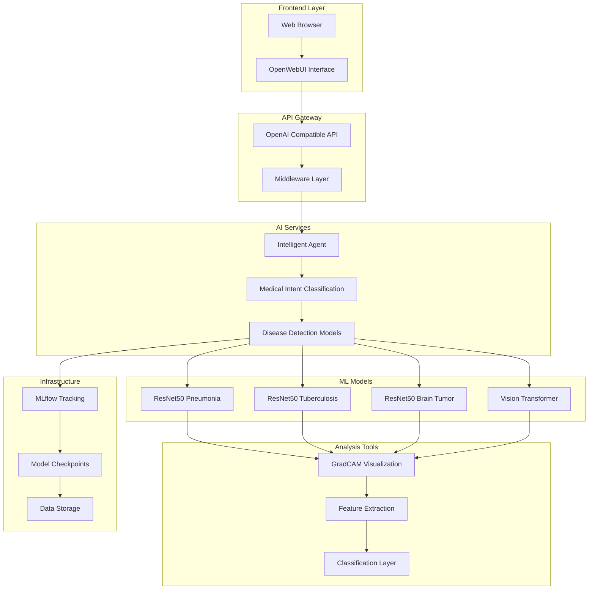

# OpenMed: AI-Powered Medical Imaging Analysis Platform

<div align="center">


*Advanced AI-powered medical imaging analysis platform for multi-disease detection*

</div>

## 🏥 Overview

OpenMed is a comprehensive AI-powered medical imaging analysis platform that combines deep learning, computer vision, and conversational AI to assist healthcare professionals in medical image interpretation. The system provides automated detection and classification for multiple medical conditions including pneumonia, tuberculosis, and brain tumors.

### Key Features

- 🔬 **Multi-Disease Detection**: Pneumonia, Tuberculosis, and Brain Tumor classification
- 🤖 **Intelligent Agent**: OpenAI-powered conversational interface for medical analysis
- 📊 **Visual Explanations**: GradCAM-based interpretability for clinical insights
- 🌐 **Web Interface**: User-friendly OpenWebUI integration
- 🔌 **API-First Design**: RESTful APIs for seamless integration
- 📈 **MLflow Integration**: Comprehensive experiment tracking and model management
- 🎯 **Transfer Learning**: Pre-trained ResNet50 and Vision Transformer models
- 🛡️ **Production Ready**: Robust error handling and monitoring

## 🔍 Interpretability, Trust & Transparency in Medical AI

In the medical domain, the stakes for AI decision-making are exceptionally high, where incorrect diagnoses can have life-altering consequences. **Trust, interpretability, and transparency are not just desirable features but essential requirements** for successful adoption of AI systems in healthcare.

### Why Medical AI Needs Explainability

Medical professionals require clear understanding of AI reasoning to:
- **Validate AI recommendations** against clinical expertise
- **Identify potential biases** in model predictions
- **Build confidence** in AI-assisted diagnoses
- **Ensure regulatory compliance** with medical standards
- **Facilitate physician training** and knowledge transfer
- **Enable accountability** in clinical decision-making

### OpenMed's Approach to Interpretability

#### 1. **Visual Explanations with GradCAM**
- **Attention Mapping**: Highlights anatomical regions that influenced the AI's decision
- **Clinical Relevance**: Shows whether the AI focuses on medically relevant areas
- **Confidence Visualization**: Provides heat maps indicating certainty levels
- **Multi-class Support**: Explains decisions across different disease categories

```python
# Generate interpretable analysis
gradcam_result = generate_gradcam(
    model_path="checkpoints/pneumonia_model.pth",
    image_path="chest_xray.jpg",
    target_class="pneumonia"
)
# Returns: Visual explanation showing areas of concern
```

#### 2. **Confidence Scoring & Uncertainty Quantification**
- **Prediction Confidence**: Numerical confidence scores (0-100%) for all predictions
- **Uncertainty Bounds**: Statistical measures of model uncertainty
- **Decision Thresholds**: Configurable confidence levels for different clinical scenarios
- **Risk Stratification**: Categorizes cases as low, medium, or high confidence

#### 3. **Conversational Explanations**
The intelligent agent provides:
- **Natural Language Reasoning**: Plain-language explanations of diagnostic reasoning
- **Evidence Summarization**: Key findings that support or contradict diagnoses
- **Differential Diagnosis**: Alternative possibilities and their likelihood
- **Clinical Context**: Integration with patient history and symptoms

#### 4. **Audit Trail & Provenance**
- **Decision Logging**: Complete record of AI reasoning processes
- **Model Versioning**: Tracks which model version made each prediction
- **Input Validation**: Records image quality and preprocessing steps
- **Temporal Consistency**: Monitors model performance over time

### Building Trust Through Transparency

#### **Model Performance Transparency**
- **Real-world Validation**: Performance metrics on diverse patient populations
- **Bias Assessment**: Regular evaluation for demographic and acquisition biases
- **Failure Mode Analysis**: Documentation of known limitations and edge cases
- **Continuous Monitoring**: Ongoing assessment of model drift and degradation

#### **Clinical Integration Standards**
- **Workflow Integration**: Seamless incorporation into existing clinical workflows
- **Second Opinion Framework**: AI serves as a "second reader" rather than replacement
- **Human-AI Collaboration**: Designed to augment, not replace, clinical expertise
- **Override Capabilities**: Healthcare professionals can always override AI recommendations

#### **Regulatory Compliance & Quality Assurance**
- **FDA Guidelines**: Adherence to medical device software regulations
- **HIPAA Compliance**: Patient data privacy and security standards
- **Clinical Validation**: Evidence-based validation on relevant patient cohorts
- **Quality Metrics**: Standardized performance reporting for clinical use

### Trust Metrics & Validation

OpenMed implements multiple layers of trust validation:

| Trust Factor | Implementation | Validation Method |
|--------------|----------------|-------------------|
| **Clinical Accuracy** | Multi-dataset validation | Cross-validation on real clinical data |
| **Interpretability** | GradCAM + NLP explanations | Radiologist review of explanations |
| **Consistency** | Temporal stability testing | Same-image repeat analysis |
| **Bias Detection** | Demographic performance analysis | Subgroup analysis by age, gender, ethnicity |
| **Failure Handling** | Graceful degradation | Edge case testing and documentation |

### Encouraging Adoption Through Transparency

#### **Education & Training Integration**
- **Interactive Learning**: AI explanations serve as teaching tools for medical students
- **Pattern Recognition**: Helps clinicians identify subtle diagnostic patterns
- **Continuous Learning**: System learns from clinician feedback and corrections
- **Best Practice Sharing**: Anonymized case studies and successful diagnostic patterns

#### **Stakeholder Communication**
- **Patient Communication**: Clear, understandable reports for patient discussions
- **Peer Review**: Tools for sharing and discussing AI-assisted diagnoses
- **Quality Improvement**: Metrics and insights for healthcare system optimization
- **Research Support**: Data and insights for ongoing medical research

### Future Enhancements for Trust & Transparency

- **Counterfactual Explanations**: "What would need to change for a different diagnosis?"
- **Temporal Reasoning**: Analysis of disease progression over time
- **Multi-modal Integration**: Combining imaging with clinical data for richer explanations
- **Personalized Risk Assessment**: Patient-specific risk factors and predictions
- **Collaborative Learning**: Integration with clinical decision support systems

> **Note**: OpenMed's interpretability features are designed to support, not replace, clinical judgment. All AI-generated insights should be validated by qualified healthcare professionals before making clinical decisions.

## 🏗️ System Architecture



## 🚀 Quick Start

### Prerequisites

- Python 3.8+
- CUDA-compatible GPU (recommended)
- 8GB+ RAM
- 20GB+ storage space

### Installation

1. **Clone the repository**
   ```bash
   git clone <repository-url>
   cd openMed
   ```

2. **Run the setup script**
   ```bash
   # Windows
   .\initial_setup.sh
   
   # Linux/Mac
   chmod +x initial_setup.sh
   ./initial_setup.sh
   ```

3. **Activate virtual environment**
   ```bash
   # Windows
   .\venv\Scripts\activate
   
   # Linux/Mac
   source venv/bin/activate
   ```

4. **Configure environment variables**
   ```bash
   # Create .env file
   echo "OPENAI_API_KEY=your_openai_api_key_here" > .env
   ```

### Quick Launch

1. **Start the backend API**
   ```bash
   cd src/middleware
   python run_backend.py
   ```

2. **Launch the web interface**
   ```bash
   # Windows
   run_openweb.bat
   
   # Linux/Mac
   open-webui serve --host 0.0.0.0 --port 3000
   ```

3. **Access the interface**
   - Web UI: http://localhost:3000
   - API Documentation: http://localhost:8000/docs

## 🔧 System Components

### 1. Intelligent Agent (`src/agent/`)

OpenAI-powered conversational agent that:
- Analyzes user prompts for medical intent
- Classifies requests into disease categories
- Provides confidence scores and reasoning
- Supports multi-turn conversations

```python
from src.agent.agent import analyze_medical_intent

result = analyze_medical_intent("Can you check this chest X-ray for pneumonia?")
print(result['wants_medical_analysis'])  # True
print(result['disease_type'])  # 'pneumonia'
print(result['confidence'])  # 0.95
```

### 2. Deep Learning Models (`src/rd/`)

#### Supported Medical Conditions

| Disease | Model | Classes | Accuracy | Data Type |
|---------|-------|---------|----------|-----------|
| Pneumonia | ResNet50 | 2 (Normal, Pneumonia) | >85% | Chest X-rays |
| Tuberculosis | ResNet50 | 2 (Normal, TB) | >85% | Chest X-rays |
| Brain Tumor | ResNet50 | 3 (Glioma, Meningioma, Tumor) | >70% | Brain MRI |

#### Model Training

```bash
# Train pneumonia detection model
cd src/rd
python resnet50_PNEUMONIA.py

# Train tuberculosis detection model
python resnet50_tb_full.py

# Train brain tumor classification model
python resnet50_brain_tumor_full.py
```

### 3. API Services (`src/middleware/`)

RESTful APIs with OpenAI compatibility:

#### Core Endpoints

| Endpoint | Method | Description |
|----------|--------|-------------|
| `/v1/models` | GET | List available models |
| `/v1/chat/completions` | POST | Chat-based medical analysis |
| `/v1/completions` | POST | Text completion |
| `/health` | GET | System health check |

#### Model-Specific APIs

| Service | Port | Description |
|---------|------|-------------|
| Feature Extractor | 6001 | Extract features from medical images |
| Classifier | 6005 | Classify extracted features |

### 4. Visual Explanations (`src/utils/`)

GradCAM-based interpretability:
- Highlights regions of interest in medical images
- Provides visual explanations for model decisions
- Supports clinical validation and trust

```python
from src.utils.gradcam import generate_gradcam

# Generate GradCAM for pneumonia detection
gradcam_result = generate_gradcam(
    model_path="checkpoints/pneumonia_model.pth",
    image_path="chest_xray.jpg",
    target_class="pneumonia"
)
```

## 📊 Monitoring and Tracking

### MLflow Integration

Each medical condition runs its own MLflow server:

- **Pneumonia**: http://localhost:5000
- **Tuberculosis**: http://localhost:5001
- **Brain Tumor**: http://localhost:5002

### Tracked Metrics

- Training/Validation Accuracy
- F1 Score, Precision, Recall
- AUC-ROC scores
- Confusion matrices
- Model artifacts and checkpoints

## 🔍 Usage Examples

### 1. Web Interface Usage

1. Open http://localhost:3000
2. Upload medical image
3. Ask: "Can you analyze this chest X-ray for pneumonia?"
4. Review analysis results and GradCAM visualization

### 2. API Usage

```python
import requests
from PIL import Image
import base64

# Load and encode image
with open("chest_xray.jpg", "rb") as f:
    img_data = base64.b64encode(f.read()).decode()

# Send analysis request
response = requests.post(
    "http://localhost:8000/v1/chat/completions",
    json={
        "model": "openmed-medical-v1",
        "messages": [
            {
                "role": "user", 
                "content": "Analyze this chest X-ray for pneumonia signs"
            }
        ],
        "image": img_data
    }
)

result = response.json()
print(result['choices'][0]['message']['content'])
```

### 3. Direct Model Inference

```python
# Feature extraction
response = requests.post(
    "http://localhost:6001/extract_features",
    json={"image_base64": img_data}
)
features = response.json()["features"]

# Classification
response = requests.post(
    "http://localhost:6005/classify",
    json={"features": features}
)
prediction = response.json()["predicted_classes"]
```

## 🛠️ Development

### Project Structure

```
openMed/
├── src/
│   ├── agent/              # Intelligent agent
│   ├── middleware/         # API services
│   ├── models_layered/     # Layered model APIs
│   ├── rd/                 # Research & development models
│   ├── utils/              # Utility functions
│   └── nb/                 # Jupyter notebooks
├── checkpoints/            # Model checkpoints
├── gradcam_results/        # GradCAM outputs
├── mlruns/                 # MLflow experiments
├── test_images/            # Test datasets
├── docs/                   # Documentation
├── requirements.txt        # Dependencies
└── README.md              # This file
```

### Adding New Models

1. **Create model script** in `src/rd/`
2. **Add GradCAM support** for interpretability
3. **Configure MLflow** tracking
4. **Update API endpoints** in middleware
5. **Test integration** with web interface

### Configuration

Key configuration files:
- `src/middleware/config.py` - API configuration
- `requirements.txt` - Python dependencies
- `.env` - Environment variables

## 🔐 Security Considerations

- API key authentication for OpenAI services
- Input validation for medical images
- Rate limiting on API endpoints
- Secure file upload handling
- CORS configuration for web interface

## 📈 Performance Optimization

### Recommended Hardware

- **GPU**: NVIDIA RTX 3070+ (8GB VRAM)
- **CPU**: 8+ cores
- **RAM**: 16GB+
- **Storage**: SSD with 50GB+ free space

### Optimization Tips

- Use batch processing for multiple images
- Enable GPU acceleration for inference
- Implement caching for frequent requests
- Use model quantization for deployment

## 🤝 Contributing

1. Fork the repository
2. Create a feature branch
3. Implement your changes
4. Add tests and documentation
5. Submit a pull request

## 📝 License

This project is licensed under the MIT License - see the LICENSE file for details.

## 🙏 Acknowledgments

- OpenAI for GPT models and API
- PyTorch team for deep learning framework
- Open WebUI community for interface components
- Medical imaging datasets contributors
- MLflow for experiment tracking

## 📞 Support

For technical support or questions:
- Create an issue on GitHub
- Check the documentation in `/docs`
- Review API documentation at http://localhost:8000/docs

---

<div align="center">

**OpenMed - Advancing Medical AI for Better Healthcare**

*Made with ❤️ for the medical community*

</div> 