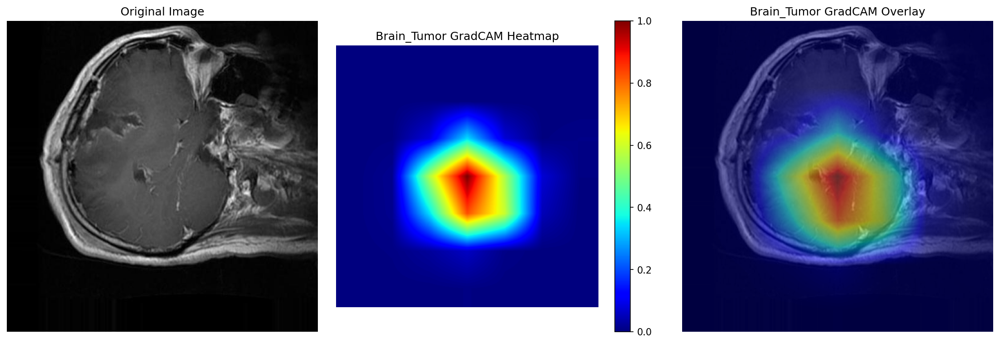
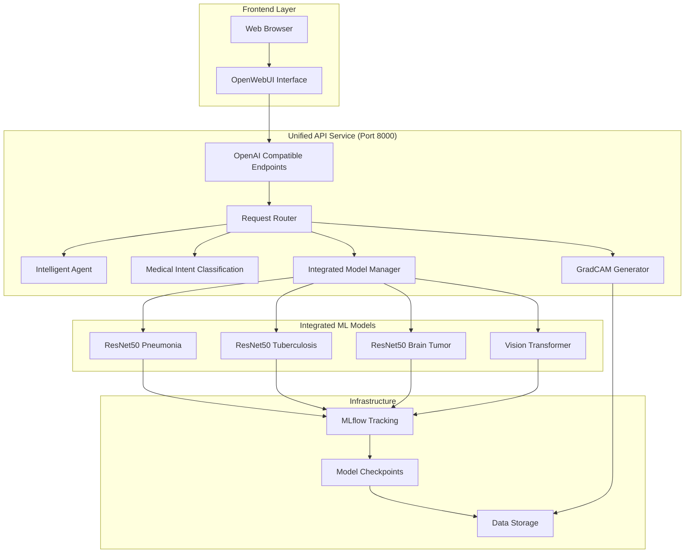

# OpenMed: AI-Powered Medical Imaging Analysis Platform

<div align="center">


*Advanced AI-powered medical imaging analysis platform for multi-disease detection*

</div>

## 🏥 Overview

OpenMed is a comprehensive AI-powered medical imaging analysis platform that combines deep learning, computer vision, and conversational AI to assist healthcare professionals in medical image interpretation. The system provides automated detection and classification for multiple medical conditions including pneumonia, tuberculosis, and brain tumors.

### Key Features

- 🔬 **Multi-Disease Detection**: Pneumonia, Tuberculosis, and Brain Tumor classification
- 🤖 **Intelligent Agent**: OpenAI-powered conversational interface for medical analysis
- 📊 **Visual Explanations**: GradCAM-based interpretability for clinical insights
- 🌐 **Web Interface**: User-friendly OpenWebUI integration
- 🔌 **API-First Design**: RESTful APIs for seamless integration
- 📈 **MLflow Integration**: Comprehensive experiment tracking and model management
- 🎯 **Transfer Learning**: Pre-trained ResNet50 and Vision Transformer models
- 🛡️ **Production Ready**: Robust error handling and monitoring

## 🔍 Interpretability, Trust & Transparency in Medical AI

In the medical domain, the stakes for AI decision-making are exceptionally high, where incorrect diagnoses can have life-altering consequences. **Trust, interpretability, and transparency are not just desirable features but essential requirements** for successful adoption of AI systems in healthcare.

### Why Medical AI Needs Explainability

Medical professionals require clear understanding of AI reasoning to:
- **Validate AI recommendations** against clinical expertise
- **Identify potential biases** in model predictions
- **Build confidence** in AI-assisted diagnoses
- **Ensure regulatory compliance** with medical standards
- **Facilitate physician training** and knowledge transfer
- **Enable accountability** in clinical decision-making

### OpenMed's Approach to Interpretability

#### 1. **Visual Explanations with GradCAM**
- **Attention Mapping**: Highlights anatomical regions that influenced the AI's decision
- **Clinical Relevance**: Shows whether the AI focuses on medically relevant areas
- **Confidence Visualization**: Provides heat maps indicating certainty levels
- **Multi-class Support**: Explains decisions across different disease categories

```python
# Generate interpretable analysis
gradcam_result = generate_gradcam(
    model_path="checkpoints/pneumonia_model.pth",
    image_path="chest_xray.jpg",
    target_class="pneumonia"
)
# Returns: Visual explanation showing areas of concern
```

**Example: Brain Tumor Detection with GradCAM Visualization**



*The image above demonstrates OpenMed's GradCAM visualization highlighting the regions of interest in brain MRI scans that contribute to tumor detection, providing clinicians with interpretable insights into the AI's decision-making process.*

#### 2. **Confidence Scoring & Uncertainty Quantification**
- **Prediction Confidence**: Numerical confidence scores (0-100%) for all predictions
- **Uncertainty Bounds**: Statistical measures of model uncertainty
- **Decision Thresholds**: Configurable confidence levels for different clinical scenarios
- **Risk Stratification**: Categorizes cases as low, medium, or high confidence

#### 3. **Conversational Explanations**
The intelligent agent provides:
- **Natural Language Reasoning**: Plain-language explanations of diagnostic reasoning
- **Evidence Summarization**: Key findings that support or contradict diagnoses
- **Differential Diagnosis**: Alternative possibilities and their likelihood
- **Clinical Context**: Integration with patient history and symptoms

#### 4. **Audit Trail & Provenance**
- **Decision Logging**: Complete record of AI reasoning processes
- **Model Versioning**: Tracks which model version made each prediction
- **Input Validation**: Records image quality and preprocessing steps
- **Temporal Consistency**: Monitors model performance over time

### Building Trust Through Transparency

#### **Model Performance Transparency**
- **Real-world Validation**: Performance metrics on diverse patient populations
- **Bias Assessment**: Regular evaluation for demographic and acquisition biases
- **Failure Mode Analysis**: Documentation of known limitations and edge cases
- **Continuous Monitoring**: Ongoing assessment of model drift and degradation

#### **Clinical Integration Standards**
- **Workflow Integration**: Seamless incorporation into existing clinical workflows
- **Second Opinion Framework**: AI serves as a "second reader" rather than replacement
- **Human-AI Collaboration**: Designed to augment, not replace, clinical expertise
- **Override Capabilities**: Healthcare professionals can always override AI recommendations

#### **Regulatory Compliance & Quality Assurance**
- **FDA Guidelines**: Adherence to medical device software regulations
- **HIPAA Compliance**: Patient data privacy and security standards
- **Clinical Validation**: Evidence-based validation on relevant patient cohorts
- **Quality Metrics**: Standardized performance reporting for clinical use

### Trust Metrics & Validation

OpenMed implements multiple layers of trust validation:

| Trust Factor | Implementation | Validation Method |
|--------------|----------------|-------------------|
| **Clinical Accuracy** | Multi-dataset validation | Cross-validation on real clinical data |
| **Interpretability** | GradCAM + NLP explanations | Radiologist review of explanations |
| **Consistency** | Temporal stability testing | Same-image repeat analysis |
| **Bias Detection** | Demographic performance analysis | Subgroup analysis by age, gender, ethnicity |
| **Failure Handling** | Graceful degradation | Edge case testing and documentation |

### Encouraging Adoption Through Transparency

#### **Education & Training Integration**
- **Interactive Learning**: AI explanations serve as teaching tools for medical students
- **Pattern Recognition**: Helps clinicians identify subtle diagnostic patterns
- **Continuous Learning**: System learns from clinician feedback and corrections
- **Best Practice Sharing**: Anonymized case studies and successful diagnostic patterns

#### **Stakeholder Communication**
- **Patient Communication**: Clear, understandable reports for patient discussions
- **Peer Review**: Tools for sharing and discussing AI-assisted diagnoses
- **Quality Improvement**: Metrics and insights for healthcare system optimization
- **Research Support**: Data and insights for ongoing medical research

### Future Enhancements for Trust & Transparency

- **Counterfactual Explanations**: "What would need to change for a different diagnosis?"
- **Temporal Reasoning**: Analysis of disease progression over time
- **Multi-modal Integration**: Combining imaging with clinical data for richer explanations
- **Personalized Risk Assessment**: Patient-specific risk factors and predictions
- **Collaborative Learning**: Integration with clinical decision support systems

> **Note**: OpenMed's interpretability features are designed to support, not replace, clinical judgment. All AI-generated insights should be validated by qualified healthcare professionals before making clinical decisions.

## 🏗️ System Architecture



## 🚀 Quick Start

### Prerequisites

- Python 3.8+
- CUDA-compatible GPU (recommended)
- 8GB+ RAM
- 20GB+ storage space

### Installation

1. **Clone the repository**
   ```bash
   git clone <repository-url>
   cd openMed
   ```

2. **Run the setup script**
   ```bash
   # Windows
   .\initial_setup.sh
   
   # Linux/Mac
   chmod +x initial_setup.sh
   ./initial_setup.sh
   ```

3. **Activate virtual environment**
   ```bash
   # Windows
   .\venv\Scripts\activate
   
   # Linux/Mac
   source venv/bin/activate
   ```

4. **Configure environment variables**
   ```bash
   # Create .env file
   echo "OPENAI_API_KEY=your_openai_api_key_here" > .env
   ```

### Quick Launch

#### Step 1: Start the Unified Models API

The OpenMed API integrates all medical models into a single service for streamlined deployment.

```bash
# Navigate to the middleware directory
cd src/middleware

# Start the unified API server (this loads all medical models)
python run_backend.py
```

**What happens during startup:**
- ✅ Loads pneumonia detection model (ResNet50)
- ✅ Loads tuberculosis detection model (ResNet50) 
- ✅ Loads brain tumor classification model (ResNet50)
- ✅ Initializes GradCAM visualization engine
- ✅ Starts OpenAI-compatible API endpoints on port 8000
- ✅ Enables intelligent medical agent

**Expected startup output:**
```
INFO: Loading pneumonia detection model...
INFO: Loading tuberculosis detection model...
INFO: Loading brain tumor classification model...
INFO: All models loaded successfully
INFO: Starting OpenMed Unified API on http://0.0.0.0:8000
INFO: API documentation available at http://localhost:8000/docs
```

#### Step 2: Verify API is Running

Test that all models are loaded and accessible:

```bash
# Test API health (should show all models as "loaded")
curl -X GET http://localhost:8000/health

# List available models
curl -X GET http://localhost:8000/v1/models

# Test a quick analysis (optional)
curl -X POST http://localhost:8000/v1/analyze \
  -H "Content-Type: application/json" \
  -d '{"test": true}'
```

**Expected health response for Unified API (Port 8000):**
```json
{
  "status": "healthy",
  "models": {
    "pneumonia_detection": "loaded",
    "tuberculosis_detection": "loaded", 
    "brain_tumor_classification": "loaded"
  },
  "services": {
    "unified_api": "running",
    "agent": "running",
    "gradcam": "available"
  }
}
```

**Expected health response for ResNet50 Model API (Port 6010):**
```json
{
  "status": "healthy",
  "models_loaded": {
    "pneumonia": true,
    "brain_tumor": true,
    "tb": true
  },
  "device": "cuda"
}
```

#### Step 3: Launch the Web Interface

```bash
# Windows
run_openweb.bat

# Linux/Mac  
open-webui serve --host 0.0.0.0 --port 3000
```

#### Step 4: (Optional) Start ResNet50 Direct Model API

For direct access to ResNet50 models with comprehensive GradCAM support, you can also run the dedicated models API:

```bash
# Navigate to models_layered directory
cd src/models_layered

# Start the ResNet50 Full Model API (runs on port 6010)
python resnet50_full.py
```

**What this API provides:**
- 🏥 **Direct model access** without conversational interface
- 🔬 **Dedicated endpoints** for each disease type
- 📊 **Advanced GradCAM** visualization capabilities
- ⚡ **Optimized inference** for batch processing
- 🎯 **Detailed prediction results** with confidence scores

**Available endpoints:**
- Health check: http://localhost:6010/health
- API docs: http://localhost:6010/docs
- Pneumonia prediction: http://localhost:6010/predict/pneumonia
- Brain tumor prediction: http://localhost:6010/predict/brain_tumor  
- TB prediction: http://localhost:6010/predict/tb
- Model info: http://localhost:6010/model_info

#### Step 5: Access the Platform

- **Web UI**: http://localhost:3000
- **Main API Documentation**: http://localhost:8000/docs
- **ResNet50 Model API Documentation**: http://localhost:6010/docs
- **Health Check (Main)**: http://localhost:8000/health
- **Health Check (Models)**: http://localhost:6010/health
- **Models List**: http://localhost:8000/v1/models

#### Quick API Test

Once the API is running, test it with a simple request:

```python
import requests

# Test the API is responding
response = requests.get("http://localhost:8000/health")
print("API Status:", response.json()["status"])

# Test models endpoint
models = requests.get("http://localhost:8000/v1/models")
print("Available Models:", [m["id"] for m in models.json()["data"]])
```

#### Troubleshooting Startup Issues

**If models fail to load:**
```bash
# Check if model checkpoints exist
ls -la checkpoints/
# Should contain: pneumonia_model.pth, tb_model.pth, brain_tumor_model.pth
```

**If CUDA memory issues occur:**
```bash
# Force CPU usage
export CUDA_VISIBLE_DEVICES=""
python run_backend.py
```

**If port 8000 is in use:**
```bash
# Check what's using port 8000
netstat -tulpn | grep :8000
# Kill the process or use a different port
python run_backend.py --port 8001
```

> **⚠️ Important**: OpenMed now uses a **unified API architecture**. All medical models and services run on a single API server (port 8000). There are no separate services for feature extraction or classification. This change simplifies deployment and improves performance.

## 🔧 System Components

### 1. Intelligent Agent (`src/agent/`)

OpenAI-powered conversational agent that:
- Analyzes user prompts for medical intent
- Classifies requests into disease categories
- Provides confidence scores and reasoning
- Supports multi-turn conversations

```python
from src.agent.agent import analyze_medical_intent

result = analyze_medical_intent("Can you check this chest X-ray for pneumonia?")
print(result['wants_medical_analysis'])  # True
print(result['disease_type'])  # 'pneumonia'
print(result['confidence'])  # 0.95
```

### 2. Deep Learning Models (`src/rd/`)

#### Supported Medical Conditions

| Disease | Model | Classes | Accuracy | Data Type |
|---------|-------|---------|----------|-----------|
| Pneumonia | ResNet50 | 2 (Normal, Pneumonia) | >85% | Chest X-rays |
| Tuberculosis | ResNet50 | 2 (Normal, TB) | >85% | Chest X-rays |
| Brain Tumor | ResNet50 | 3 (Glioma, Meningioma, Tumor) | >70% | Brain MRI |

#### Model Training

```bash
# Train pneumonia detection model
cd src/rd
python resnet50_PNEUMONIA.py

# Train tuberculosis detection model
python resnet50_tb_full.py

# Train brain tumor classification model
python resnet50_brain_tumor_full.py
```

### 3. Unified API Service (`src/middleware/`)

Single RESTful API with OpenAI compatibility that integrates all medical models:

#### Core Endpoints

| Endpoint | Method | Description |
|----------|--------|-------------|
| `/v1/models` | GET | List available medical models |
| `/v1/chat/completions` | POST | Chat-based medical analysis with conversational AI |
| `/v1/analyze` | POST | Direct medical image analysis |
| `/v1/gradcam` | POST | Generate GradCAM visualizations |
| `/health` | GET | System and model health check |

#### Unified API Architecture

All models and services are integrated into a single API endpoint:

| Service | Port | Description |
|---------|------|-------------|
| OpenMed Unified API | 8000 | Complete medical imaging analysis with all models integrated |

> **Note**: OpenMed uses a unified API architecture where all medical models (pneumonia, tuberculosis, brain tumor detection) are integrated into a single FastAPI service running on port 8000. This simplifies deployment, reduces resource usage, and provides a consistent interface for all medical analysis tasks.

### 4. ResNet50 Direct Model API (`src/models_layered/`)

Comprehensive FastAPI service providing direct access to ResNet50 models:

**Key Features:**
- **Multi-Disease Support**: Pneumonia, Tuberculosis, Brain Tumor detection
- **Advanced GradCAM**: Comprehensive visualization with configurable target classes
- **Optimized Performance**: Direct model access without conversational overhead
- **Detailed Responses**: Complete prediction information with probabilities
- **Model Management**: Dynamic loading and health monitoring

**API Endpoints:**
```python
# Pneumonia Detection
POST /predict/pneumonia
{
    "image_base64": "...",
    "generate_gradcam": true,
    "target_class": null
}

# Brain Tumor Classification  
POST /predict/brain_tumor
{
    "image_base64": "...",
    "generate_gradcam": true
}

# Tuberculosis Detection
POST /predict/tb
{
    "image_base64": "...",
    "generate_gradcam": true
}

# Model Information
GET /model_info
GET /model_info/{disease_type}
GET /health
```

**Usage Example:**
```python
import requests
import base64

# Load and encode medical image
with open("chest_xray.jpg", "rb") as f:
    img_data = base64.b64encode(f.read()).decode()

# Direct pneumonia prediction
response = requests.post(
    "http://localhost:6010/predict/pneumonia",
    json={
        "image_base64": img_data,
        "generate_gradcam": True,
        "target_class": None
    }
)

result = response.json()
print(f"Prediction: {result['prediction_label']}")
print(f"Confidence: {result['confidence']:.2%}")
print(f"GradCAM: {len(result['gradcam_heatmap'])} available" if result['gradcam_heatmap'] else "No GradCAM")
```

### 5. Visual Explanations (`src/utils/`)

GradCAM-based interpretability:
- Highlights regions of interest in medical images
- Provides visual explanations for model decisions
- Supports clinical validation and trust

```python
from src.utils.gradcam import generate_gradcam

# Generate GradCAM for pneumonia detection
gradcam_result = generate_gradcam(
    model_path="checkpoints/pneumonia_model.pth",
    image_path="chest_xray.jpg",
    target_class="pneumonia"
)
```

## 📊 Monitoring and Tracking

### MLflow Integration

Each medical condition runs its own MLflow server:

- **Pneumonia**: http://localhost:5000
- **Tuberculosis**: http://localhost:5001
- **Brain Tumor**: http://localhost:5002

### Tracked Metrics

- Training/Validation Accuracy
- F1 Score, Precision, Recall
- AUC-ROC scores
- Confusion matrices
- Model artifacts and checkpoints

## 🔍 Usage Examples

### 1. Web Interface Usage

1. Open http://localhost:3000
2. Upload medical image
3. Ask: "Can you analyze this chest X-ray for pneumonia?"
4. Review analysis results and GradCAM visualization

### 2. API Usage

```python
import requests
from PIL import Image
import base64

# Load and encode image
with open("chest_xray.jpg", "rb") as f:
    img_data = base64.b64encode(f.read()).decode()

# Send analysis request
response = requests.post(
    "http://localhost:8000/v1/chat/completions",
    json={
        "model": "openmed-medical-v1",
        "messages": [
            {
                "role": "user", 
                "content": "Analyze this chest X-ray for pneumonia signs"
            }
        ],
        "image": img_data
    }
)

result = response.json()
print(result['choices'][0]['message']['content'])
```

### 3. Direct Model Inference

```python
# Direct analysis with integrated API
response = requests.post(
    "http://localhost:8000/v1/analyze",
    json={
        "image": img_data,
        "disease_type": "pneumonia",  # or "tuberculosis", "brain_tumor"
        "include_gradcam": True
    }
)

result = response.json()
print(f"Prediction: {result['prediction']}")
print(f"Confidence: {result['confidence']}")
print(f"GradCAM available: {result['gradcam_path']}")
```

## 🧪 Testing Instructions

This section provides comprehensive testing instructions for the OpenMed platform to ensure all components function correctly before deployment.

### Prerequisites for Testing

Before running tests, ensure you have:
- All dependencies installed via `pip install -r requirements.txt`
- Virtual environment activated
- OpenAI API key configured in `.env` file
- Test images available in `test_images/` directory
- Sufficient disk space for temporary test files

### 1. System Health Check

**Quick System Verification**
```bash
# Test basic system health
python -c "import torch; print(f'PyTorch: {torch.__version__}')"
python -c "import torch; print(f'CUDA Available: {torch.cuda.is_available()}')"
python -c "import fastapi; print(f'FastAPI: {fastapi.__version__}')"
```

**Environment Verification**
```bash
# Check if all required directories exist
ls -la checkpoints/
ls -la test_images/
ls -la src/
```

### 2. Backend API Testing

**Start Backend Services**
```bash
# Option 1: Start the unified API server (recommended for most users)
cd src/middleware
python run_backend.py
# Unified API serves all models on port 8000

# Option 2: Start the ResNet50 Direct Model API (for advanced users)
cd src/models_layered
python resnet50_full.py
# Direct model API serves on port 6010 with dedicated endpoints
```

**API Health Check Tests**

*For Unified API (Port 8000):*
```bash
# Test unified API health endpoint
curl -X GET http://localhost:8000/health

# Test models endpoint
curl -X GET http://localhost:8000/v1/models

# Test analysis endpoint availability
curl -X GET http://localhost:8000/v1/analyze/health
```

*For ResNet50 Direct Model API (Port 6010):*
```bash
# Test ResNet50 model API health
curl -X GET http://localhost:6010/health

# Get model information
curl -X GET http://localhost:6010/model_info

# Test specific disease model info
curl -X GET http://localhost:6010/model_info/pneumonia
curl -X GET http://localhost:6010/model_info/brain_tumor
curl -X GET http://localhost:6010/model_info/tb
```

**Expected Response for Health Check:**
```json
{
  "status": "healthy",
  "timestamp": "2024-01-01T12:00:00Z",
  "version": "1.0.0",
  "models": {
    "pneumonia_detection": "loaded",
    "tuberculosis_detection": "loaded",
    "brain_tumor_classification": "loaded"
  },
  "services": {
    "unified_api": "running",
    "agent": "running",
    "gradcam": "available"
  }
}
```

### 3. Model Inference Testing

**Test Individual Models**
```bash
# Test pneumonia detection model
cd src/rd
python test_pneumonia_model.py --image_path ../../test_images/chest_xray_normal.jpg

# Test tuberculosis detection model
python test_tb_model.py --image_path ../../test_images/chest_xray_tb.jpg

# Test brain tumor classification model
python test_brain_tumor_model.py --image_path ../../test_images/brain_mri_tumor.jpg
```

**Expected Model Output:**
```json
{
  "prediction": "pneumonia",
  "confidence": 0.87,
  "processing_time": 2.3,
  "model_version": "v1.2.0"
}
```

### 4. GradCAM Visualization Testing

**Test GradCAM Generation**
```python
# Run GradCAM test script
cd src/utils
python test_gradcam.py

# Expected: GradCAM images saved to gradcam_results/test_output/
```

**Manual GradCAM Test**
```python
from src.utils.gradcam import generate_gradcam

# Test GradCAM for pneumonia
result = generate_gradcam(
    model_path="../../checkpoints/pneumonia_model.pth",
    image_path="../../test_images/chest_xray_pneumonia.jpg",
    target_class="pneumonia"
)

print(f"GradCAM generated: {result['gradcam_path']}")
print(f"Confidence: {result['confidence']}")
```

### 5. Intelligent Agent Testing

**Test Medical Intent Classification**
```python
cd src/agent
python test_agent.py

# Test various medical queries
test_queries = [
    "Can you analyze this chest X-ray for pneumonia?",
    "Check this brain MRI for tumors",
    "What do you see in this TB screening image?",
    "Hello, how are you today?"  # Non-medical query
]
```

**Expected Agent Response:**
```json
{
  "wants_medical_analysis": true,
  "disease_type": "pneumonia",
  "confidence": 0.95,
  "reasoning": "User is requesting pneumonia analysis of chest X-ray"
}
```

### 6. Full Integration Testing

**End-to-End API Test with Chat Completions**
```python
import requests
import base64
import json

# Load test image
with open("test_images/chest_xray_pneumonia.jpg", "rb") as f:
    img_data = base64.b64encode(f.read()).decode()

# Test complete workflow via chat completions
response = requests.post(
    "http://localhost:8000/v1/chat/completions",
    json={
        "model": "openmed-medical-v1",
        "messages": [
            {
                "role": "user",
                "content": "Analyze this chest X-ray for pneumonia signs"
            }
        ],
        "image": img_data,
        "temperature": 0.1
    },
    headers={"Content-Type": "application/json"}
)

print(f"Status Code: {response.status_code}")
print(f"Response: {json.dumps(response.json(), indent=2)}")
```

**Direct Analysis API Test**
```python
# Test direct analysis endpoint (unified API)
response = requests.post(
    "http://localhost:8000/v1/analyze",
    json={
        "image": img_data,
        "analysis_type": "pneumonia",
        "include_gradcam": True,
        "confidence_threshold": 0.5
    }
)

result = response.json()
print(f"Direct Analysis - Prediction: {result.get('prediction')}")
print(f"Direct Analysis - Confidence: {result.get('confidence')}")
print(f"Direct Analysis - GradCAM: {result.get('gradcam_available')}")
```

### 7. ResNet50 Direct Model API Testing

**Test Disease-Specific Endpoints**

*Pneumonia Detection:*
```python
import requests
import base64

# Load test chest X-ray
with open("test_images/chest_xray_pneumonia.jpg", "rb") as f:
    img_data = base64.b64encode(f.read()).decode()

# Test pneumonia prediction with GradCAM
response = requests.post(
    "http://localhost:6010/predict/pneumonia",
    json={
        "image_base64": img_data,
        "generate_gradcam": True,
        "target_class": None  # Use predicted class
    }
)

result = response.json()
print(f"Pneumonia Prediction: {result['prediction_label']}")
print(f"Confidence: {result['confidence']:.2%}")
print(f"GradCAM Generated: {'Yes' if result['gradcam_heatmap'] else 'No'}")
```

*Brain Tumor Classification:*
```python
# Load test brain MRI
with open("test_images/brain_mri_tumor.jpg", "rb") as f:
    img_data = base64.b64encode(f.read()).decode()

# Test brain tumor prediction
response = requests.post(
    "http://localhost:6010/predict/brain_tumor",
    json={
        "image_base64": img_data,
        "generate_gradcam": True
    }
)

result = response.json()
print(f"Brain Tumor Type: {result['prediction_label']}")
print(f"Confidence: {result['confidence']:.2%}")
print(f"All Probabilities: {result['probabilities']}")
```

*Tuberculosis Detection:*
```python
# Load test TB X-ray
with open("test_images/chest_xray_tb.jpg", "rb") as f:
    img_data = base64.b64encode(f.read()).decode()

# Test TB prediction
response = requests.post(
    "http://localhost:6010/predict/tb",
    json={
        "image_base64": img_data,
        "generate_gradcam": True
    }
)

result = response.json()
print(f"TB Prediction: {result['prediction_label']}")
print(f"Confidence: {result['confidence']:.2%}")
```

**Test Model Information Endpoints**
```python
# Get information about all models
models_info = requests.get("http://localhost:6010/model_info")
print("All Models Info:", models_info.json())

# Get specific model information
pneumonia_info = requests.get("http://localhost:6010/model_info/pneumonia")
print("Pneumonia Model Info:", pneumonia_info.json())
```

**Expected Response Format:**
```json
{
  "success": true,
  "disease_type": "pneumonia",
  "predicted_class": 1,
  "confidence": 0.87,
  "probabilities": [0.13, 0.87],
  "prediction_label": "Pneumonia",
  "class_names": ["Normal", "Pneumonia"],
  "gradcam_heatmap": [[0.1, 0.2, ...], ...],
  "target_class": 1,
  "message": "Successfully predicted Pneumonia with 87.00% confidence"
}
```

**Performance Testing for ResNet50 API**
```python
import asyncio
import aiohttp
import time

async def test_resnet50_concurrent_requests():
    """Test concurrent requests to ResNet50 API"""
    async with aiohttp.ClientSession() as session:
        # Test data
        with open("test_images/chest_xray_normal.jpg", "rb") as f:
            img_data = base64.b64encode(f.read()).decode()
        
        tasks = []
        start_time = time.time()
        
        # Create 5 concurrent requests to different endpoints
        endpoints = [
            "http://localhost:6010/predict/pneumonia",
            "http://localhost:6010/predict/brain_tumor", 
            "http://localhost:6010/predict/tb",
            "http://localhost:6010/predict/pneumonia",
            "http://localhost:6010/predict/tb"
        ]
        
        for endpoint in endpoints:
            task = session.post(
                endpoint,
                json={
                    "image_base64": img_data,
                    "generate_gradcam": False  # Faster without GradCAM
                }
            )
            tasks.append(task)
        
        responses = await asyncio.gather(*tasks, return_exceptions=True)
        end_time = time.time()
        
        successful = sum(1 for r in responses if hasattr(r, 'status') and r.status == 200)
        print(f"ResNet50 API: {successful}/{len(tasks)} requests successful")
        print(f"Total time: {end_time - start_time:.2f} seconds")

# Run the test
asyncio.run(test_resnet50_concurrent_requests())
```

### 8. Web Interface Testing

**Manual Web UI Testing Checklist**

1. **Start Web Interface**
   ```bash
   # Windows
   run_openweb.bat
   
   # Linux/Mac
   open-webui serve --host 0.0.0.0 --port 3000
   ```

2. **Test Scenarios**
   - [ ] Navigate to http://localhost:3000
   - [ ] Upload chest X-ray image
   - [ ] Submit query: "Analyze this for pneumonia"
   - [ ] Verify response includes:
     - [ ] Diagnostic prediction
     - [ ] Confidence score
     - [ ] GradCAM visualization
     - [ ] Clinical explanation
   - [ ] Test with different image types (MRI, different X-rays)
   - [ ] Test conversation continuity
   - [ ] Test error handling with invalid files

### 8. Performance Testing

**Load Testing Script**
```python
# Test concurrent requests
import asyncio
import aiohttp
import time

async def test_concurrent_requests():
    async with aiohttp.ClientSession() as session:
        tasks = []
        start_time = time.time()
        
        for i in range(10):  # 10 concurrent requests
            task = session.post(
                'http://localhost:8000/v1/chat/completions',
                json={
                    "model": "openmed-medical-v1",
                    "messages": [{"role": "user", "content": "Test message"}]
                }
            )
            tasks.append(task)
        
        responses = await asyncio.gather(*tasks)
        end_time = time.time()
        
        print(f"10 concurrent requests completed in {end_time - start_time:.2f} seconds")
        print(f"Success rate: {sum(1 for r in responses if r.status == 200)}/10")

asyncio.run(test_concurrent_requests())
```

### 9. MLflow Integration Testing

**Test MLflow Tracking**
```bash
# Start MLflow servers
cd src/rd
python start_mlflow_servers.py

# Verify MLflow UIs are accessible
curl -X GET http://localhost:5000  # Pneumonia MLflow
curl -X GET http://localhost:5001  # TB MLflow
curl -X GET http://localhost:5002  # Brain Tumor MLflow
```

**Test Experiment Logging**
```python
import mlflow
import mlflow.pytorch

# Test MLflow logging
with mlflow.start_run(experiment_id="test_experiment"):
    mlflow.log_param("test_param", "test_value")
    mlflow.log_metric("test_metric", 0.95)
    print("MLflow logging test completed")
```

### 10. Automated Test Suite

**Run Complete Test Suite**
```bash
# Run all automated tests
python -m pytest tests/ -v --tb=short

# Run specific test categories
python -m pytest tests/test_models.py -v          # Model tests
python -m pytest tests/test_api.py -v             # API tests
python -m pytest tests/test_agent.py -v           # Agent tests
python -m pytest tests/test_gradcam.py -v         # GradCAM tests
python -m pytest tests/test_integration.py -v     # Integration tests
```

**Test Coverage Report**
```bash
# Generate test coverage report
python -m pytest tests/ --cov=src --cov-report=html
# Open htmlcov/index.html to view coverage report
```

### 11. Data Quality Testing

**Test Image Processing Pipeline**
```python
# Test image preprocessing
from src.utils.image_processing import preprocess_medical_image

test_images = [
    "test_images/chest_xray_normal.jpg",
    "test_images/chest_xray_pneumonia.jpg",
    "test_images/brain_mri_normal.jpg",
    "test_images/brain_mri_tumor.jpg"
]

for img_path in test_images:
    processed = preprocess_medical_image(img_path)
    print(f"{img_path}: Shape {processed.shape}, Type {processed.dtype}")
    assert processed.shape == (224, 224, 3), f"Unexpected shape for {img_path}"
```

### 12. Security Testing

**Test Input Validation**
```python
# Test malicious file upload protection
import requests

# Test various file types
test_files = [
    "test_files/malicious.exe",
    "test_files/script.js",
    "test_files/large_file.bin",  # >50MB file
    "test_files/corrupted_image.jpg"
]

for file_path in test_files:
    with open(file_path, "rb") as f:
        response = requests.post(
            "http://localhost:8000/upload",
            files={"file": f}
        )
    print(f"{file_path}: Status {response.status_code}")
    assert response.status_code in [400, 413, 415], f"Security test failed for {file_path}"
```

### Troubleshooting Common Test Issues

**Issue: CUDA Out of Memory**
```bash
# Solution: Reduce batch size or use CPU
export CUDA_VISIBLE_DEVICES=""  # Force CPU usage
```

**Issue: API Connection Refused**
```bash
# Solution: Check if the unified API service is running
ps aux | grep python  # Check running Python processes
netstat -tulpn | grep :8000  # Check if port 8000 is in use
# Only port 8000 should be in use for the unified API
```

**Issue: Model Loading Errors**
```bash
# Solution: Verify model files exist and are not corrupted
ls -la checkpoints/
python -c "import torch; torch.load('checkpoints/pneumonia_model.pth')"
```

**Issue: OpenAI API Errors**
```bash
# Solution: Verify API key and quota
python -c "import openai; print(openai.api_key)"
curl -H "Authorization: Bearer $OPENAI_API_KEY" https://api.openai.com/v1/models
```

### Test Data Requirements

Ensure you have the following test images in `test_images/`:
- `chest_xray_normal.jpg` - Normal chest X-ray
- `chest_xray_pneumonia.jpg` - Pneumonia case
- `chest_xray_tb.jpg` - Tuberculosis case
- `brain_mri_normal.jpg` - Normal brain MRI
- `brain_mri_tumor.jpg` - Brain tumor case
- `brain_mri_glioma.jpg` - Glioma case
- `brain_mri_meningioma.jpg` - Meningioma case

### Continuous Integration Testing

For automated CI/CD pipelines:
```yaml
# .github/workflows/test.yml
name: OpenMed Tests
on: [push, pull_request]
jobs:
  test:
    runs-on: ubuntu-latest
    steps:
      - uses: actions/checkout@v2
      - name: Set up Python
        uses: actions/setup-python@v2
        with:
          python-version: 3.8
      - name: Install dependencies
        run: pip install -r requirements.txt
      - name: Run tests
        run: python -m pytest tests/ -v
```

## 🛠️ Development

### Project Structure

```
openMed/
├── src/
│   ├── agent/              # Intelligent agent
│   ├── middleware/         # Unified API services
│   ├── models_layered/     # ResNet50 Direct Model API
│   ├── rd/                 # Research & development models
│   ├── utils/              # Utility functions (including GradCAM)
│   └── nb/                 # Jupyter notebooks
├── checkpoints/            # Model checkpoints
├── gradcam_results/        # GradCAM outputs
├── mlruns/                 # MLflow experiments
├── test_images/            # Test datasets
├── docs/                   # Documentation
├── requirements.txt        # Dependencies
└── README.md              # This file
```

### Adding New Models

1. **Create model script** in `src/rd/`
2. **Add GradCAM support** for interpretability
3. **Configure MLflow** tracking
4. **Integrate model** into unified API in middleware
5. **Test integration** with web interface

### Configuration

Key configuration files:
- `src/middleware/config.py` - API configuration
- `requirements.txt` - Python dependencies
- `.env` - Environment variables

## 🔐 Security Considerations

- API key authentication for OpenAI services
- Input validation for medical images
- Rate limiting on API endpoints
- Secure file upload handling
- CORS configuration for web interface

## 📈 Performance Optimization

### Recommended Hardware

- **GPU**: NVIDIA RTX 3070+ (8GB VRAM)
- **CPU**: 8+ cores
- **RAM**: 16GB+
- **Storage**: SSD with 50GB+ free space

### Optimization Tips

- Use batch processing for multiple images
- Enable GPU acceleration for inference
- Implement caching for frequent requests
- Use model quantization for deployment

## 🤝 Contributing

1. Fork the repository
2. Create a feature branch
3. Implement your changes
4. Add tests and documentation
5. Submit a pull request

## 📝 License

This project is licensed under the MIT License - see the LICENSE file for details.

## 🙏 Acknowledgments

- OpenAI for GPT models and API
- PyTorch team for deep learning framework
- Open WebUI community for interface components
- Medical imaging datasets contributors
- MLflow for experiment tracking

## 📞 Support

For technical support or questions:
- Create an issue on GitHub
- Check the documentation in `/docs`
- Review API documentation at http://localhost:8000/docs

---

<div align="center">

**OpenMed - Advancing Medical AI for Better Healthcare**

*Made with ❤️ for the medical community*

</div> 